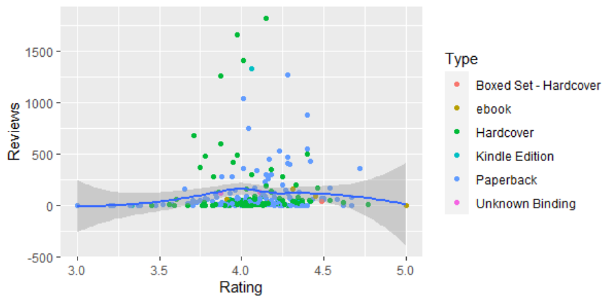
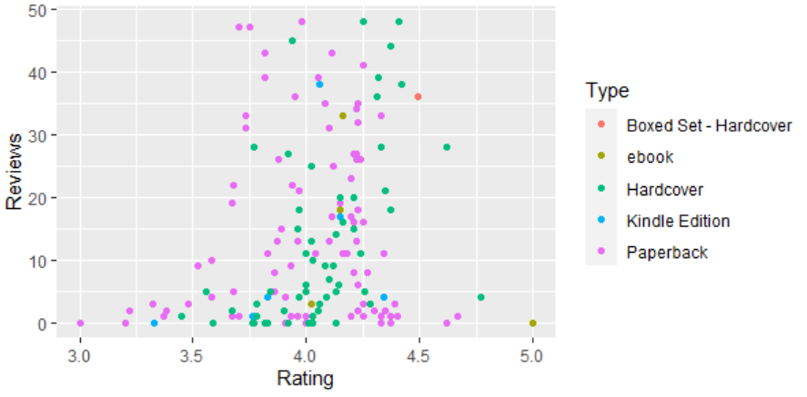
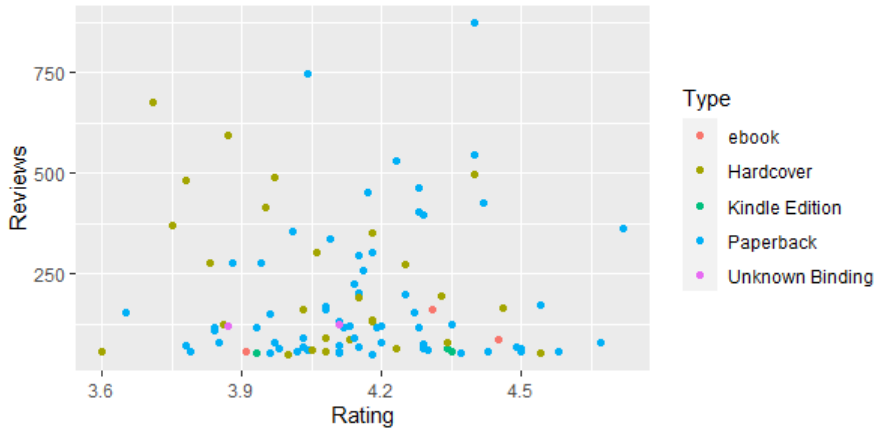
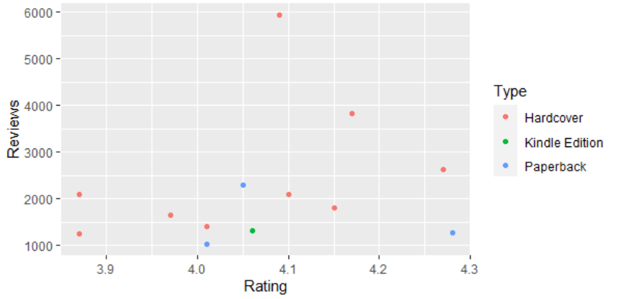

# R-Assignment 4

**Created by Name-Surname (ID: xxxxxxxxxx)**

Choose Dataset:
1. Top 270 Computer Science / Programing Books (Data from Thomas Konstantin, [Kaggle](https://www.kaggle.com/thomaskonstantin/top-270-rated-computer-science-programing-books)) >> [Using CSV](https://raw.githubusercontent.com/safesit23/INT214-Statistics/main/datasets/prog_book.csv)

2. Superstore Sales Dataset (Data from Rohit Sahoo,[Kaggle](https://www.kaggle.com/rohitsahoo/sales-forecasting)) >> [Using CSV](https://raw.githubusercontent.com/safesit23/INT214-Statistics/main/datasets/superstore_sales.csv)


### Outlines
1. Explore the dataset
2. Learning function from Tidyverse
3. Transform data with dplyr and finding insight the data
4. Visualization with GGplot2

## Part 1: Explore the dataset

```
# Library
library(readr)
library(dplyr)
library(ggplot2)
library(DescTools)
# Dataset
dataset <- read_csv("https://raw.githubusercontent.com/safesit23/INT214-Statistics/main/datasets/prog_book.csv")
```

In this dataset has 
```
Rows: 271
Columns: 7
$ Rating          <dbl> 4.17, 4.01, 3.33, 3.97, 4.06, 3.84, 4.09, 4.15, 3.~
$ Reviews         <dbl> 3829, 1406, 0, 1658, 1325, 117, 5938, 1817, 2093, ~
$ Book_title      <chr> "The Elements of Style", "The Information: A Histo~
$ Description     <chr> "This style manual offers practical advice on impr~
$ Number_Of_Pages <dbl> 105, 527, 50, 393, 305, 288, 256, 368, 259, 128, 3~
$ Type            <chr> "Hardcover", "Hardcover", "Kindle Edition", "Hardc~
$ Price           <dbl> 9.323529, 11.000000, 11.267647, 12.873529, 13.1647~
```
| Variable | Type of variable  | Meaning |
| :-------- | :-------- | :-------- |
| Rating | double | เก็บคะเเนนเรทติ่งของหนังสือเล่มนั้นๆ |
| Reviews | double | เก็บจำนวนความคิดเห็นที่มีต่อหนังสือเล่มนั้นๆ |
| Book_title | character | ชื่อหนังสือ |
| Description | character | คำอธิบายของหนังสือเล่มนั้นๆ |
| Number_Of_Pages | double | จำนวนหน้าของหนังสือ |
| Type | character | รูปแบบของหนังสือ |
| Price | double | ราคาของหนังสือหน่วยดอลลาร์ |

0. เช็คว่ามีค่า null ในตัว dataset ไหม
```
is.na(dataset)
```
  - ไม่มีข้อมูลใน dataset ที่เป็น null
   
1. ใน variable ที่เป็น Rating นั้น
```
max(dataset$Rating)
min(dataset$Rating)
mean(dataset$Rating)
Mode(dataset$Rating)

```
  - ค่าสูงสุดของRating : 5 
  - ค่าต่ำสุดของRating : 3
  - ค่ากึ่งกลางของRating : 4.067417
  - จำนวน Rating ที่ซ้ำมากที่สุด : 4.15  

2. ใน variable ที่เป็น Reviews นั้น
```
max(dataset$Reviews)
min(dataset$Reviews)
mean(dataset$Reviews)
Mode(dataset$Reviews)

```
  - ค่าสูงสุดของReviews : 5938 
  - ค่าต่ำสุดของReviews : 0
  - ค่ากึ่งกลางของReviews : 185.5572
  - จำนวน Reviews ที่ซ้ำมากที่สุด : 0  
  
3. ใน variable ที่เป็น Book_title นั้น
```
dataset$Book_title %>% duplicated() %>% table()
dataset$Book_title %>% duplicated() %>% sum()

```
  - ไม่มีตัวที่มีชื่อซ้ำ

4. ใน variable ที่เป็น Description นั้น
```
dataset$Description %>% duplicated() %>% table()
dataset$Description %>% duplicated() %>% sum()
dataset %>% filter(duplicated(dataset$Description))

```
  - มี Book_title ที่มี Description เหมือนกันอยู่เเต่จะเเบ่งเป็น type ของ ebook กับ Paperback โดย 2 ข้อมูลนี้มีชื่อใกล้เคียงกัน เเละ Rating , Reviews เเละราคา มีค่าเท่ากัน เเต่จำนวนหน้าไม่เท่ากัน

5. ใน variable ที่เป็น Number_Of_Pages นั้น
```
max(dataset$Number_Of_Pages)
min(dataset$Number_Of_Pages)
mean(dataset$Number_Of_Pages)
Mode(dataset$Number_Of_Pages)

```
  - ค่าสูงสุดของPages : 3168 
  - ค่าต่ำสุดของPages : 50
  - ค่ากึ่งกลางของPages : 475.0775 
  - จำนวนหน้าที่ซ้ำกันมากที่สุดคือ : 288

6. ใน variable ที่เป็น Type นั้น
```
 dataset %>% count(Type)

# Result: 
1 Boxed Set - Hardcover     1
2 ebook                     7
3 Hardcover                95
4 Kindle Edition           10
5 Paperback               156
6 Unknown Binding           2
```
  - ใน variable จะมี type เเค่ 6 ชนิด ตามลำดับเเละ type ที่มากที่สุด คือ Paperback
  
7. ใน variable ที่เป็น Price นั้น
```
max(dataset$Price)
min(dataset$Price)
mean(dataset$Price)
Mode(dataset$Price)

```
  - ค่าสูงสุดของPrice : 235.65 
  - ค่าต่ำสุดของPrice : 9.323529
  - ค่ากึ่งกลางของPrice : 54.54186
  - จำนวนราคาที่ซ้ำกันมากที่สุดคือ : 51.47353
  
## Part 2: Transform data with dplyr and finding insight the data

1. หาหนังสือที่ที่มี Rating ระหว่าง 4.5 - 5.0

```


```

Result:

```
#Copy Result from console to here

```
2. 

```


```

Result:

```
#Copy Result from console to here

```
3. 

```


```

Result:

```
#Copy Result from console to here

```
4. 

```


```

Result:

```
#Copy Result from console to here

```
5. 

```


```

Result:

```
#Copy Result from console to here

```
6. 

```


```

Result:

```
#Copy Result from console to here

```


## Part 3: Visualization with GGplot2
### 1.) Graph show relation between Rating and Reviews
```
# Graph relation between Rating and Reviews
 scat_plot0 <- dataset %>% filter(Reviews <= 2000 )%>% ggplot(aes(x=Rating,y=Reviews))+
   geom_point(aes(color=Type)) +geom_smooth()
 scat_plot0

# การกระจายข้อมูลในช่วง Reviews = 0 - 50
scat_plot1 <- dataset %>%filter(Reviews<50)%>%ggplot(aes(x=Rating,y=Reviews))+
   geom_point(aes(color=Type)) 
 scat_plot1

# การกระจายข้อมูลในช่วง Reviews = 50 - 1000
 scat_plot2 <- dataset %>% filter(Reviews <= 1000 ) %>% filter(Reviews >= 50 )%>%ggplot(aes(x=Rating,y=Reviews))+
   geom_point(aes(color=Type)) 
 scat_plot2
 
# การกระจายข้อมูลในช่วง Reviews = 1000 - 6000
 scat_plot3 <- dataset %>% filter(Reviews <= 6000 ) %>% filter(Reviews >= 1000 )%>%ggplot(aes(x=Rating,y=Reviews))+
   geom_point(aes(color=Type))
 scat_plot3

```
Result:
* Graph relation between Rating and Reviews

* การกระจายข้อมูลในช่วง Reviews = 0 - 50

* การกระจายข้อมูลในช่วง Reviews = 50 - 1000

* การกระจายข้อมูลในช่วง Reviews = 1000 - 6000


### 2.) แผนภูมิเเท่งเเสดงจำนวนของ type ต่างๆ
```
# แผนภูมิเเท่งเเสดงจำนวนของ type ต่างๆ
 scat_plot4 <- dataset %>% ggplot(aes(x=Type)) + geom_bar(aes(color=Type)
 scat_plot4

```
Result:
* แผนภูมิเเท่งเเสดงจำนวนของ type ต่างๆ

