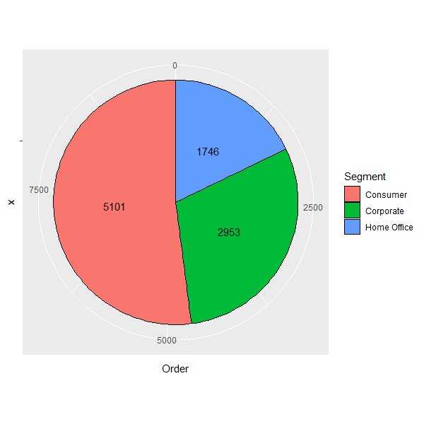
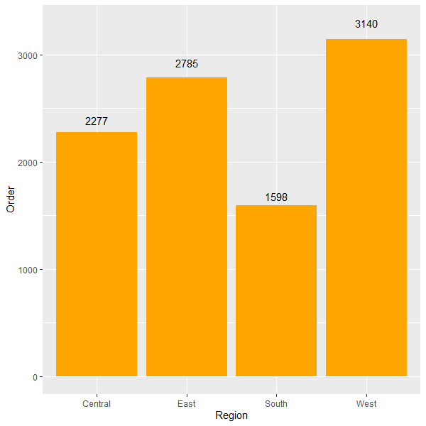

# R-Assignment 4

**Created by Purachet Zheng (ID: 63130500083)**

Choose Dataset:
Superstore Sales Dataset (Data from Rohit Sahoo,[Kaggle](https://www.kaggle.com/rohitsahoo/sales-forecasting)) >> [Using CSV](https://raw.githubusercontent.com/safesit23/INT214-Statistics/main/datasets/superstore_sales.csv)


### Outlines
1. Explore the dataset
2. Learning function from Tidyverse
3. Transform data with dplyr and finding insight the data
4. Visualization with GGplot2

## Part 1: Explore the dataset

```	
# Library
library(readr)
library(dplyr)
library(ggplot2)

# Dataset
superStore <- read_csv("https://raw.githubusercontent.com/safesit23/INT214-Statistics/main/datasets/superstore_sales.csv")
```

In this dataset has
```
Rows: 9,800
Columns: 18
Rows: 9,800
Columns: 18
$ `Row ID`        <dbl> 1, 2, 3, 4, 5, 6, 7, 8, 9, 10, 11, 12, 13, 14, 15, 16, 17, 18, 19~
$ `Order ID`      <chr> "CA-2017-152156", "CA-2017-152156", "CA-2017-138688", "US-2016-10~
$ `Order Date`    <chr> "08/11/2017", "08/11/2017", "12/06/2017", "11/10/2016", "11/10/20~
$ `Ship Date`     <chr> "11/11/2017", "11/11/2017", "16/06/2017", "18/10/2016", "18/10/20~
$ `Ship Mode`     <chr> "Second Class", "Second Class", "Second Class", "Standard Class",~
$ `Customer ID`   <chr> "CG-12520", "CG-12520", "DV-13045", "SO-20335", "SO-20335", "BH-1~
$ `Customer Name` <chr> "Claire Gute", "Claire Gute", "Darrin Van Huff", "Sean O'Donnell"~
$ Segment         <chr> "Consumer", "Consumer", "Corporate", "Consumer", "Consumer", "Con~
$ Country         <chr> "United States", "United States", "United States", "United States~
$ City            <chr> "Henderson", "Henderson", "Los Angeles", "Fort Lauderdale", "Fort~
$ State           <chr> "Kentucky", "Kentucky", "California", "Florida", "Florida", "Cali~
$ `Postal Code`   <dbl> 42420, 42420, 90036, 33311, 33311, 90032, 90032, 90032, 90032, 90~
$ Region          <chr> "South", "South", "West", "South", "South", "West", "West", "West~
$ `Product ID`    <chr> "FUR-BO-10001798", "FUR-CH-10000454", "OFF-LA-10000240", "FUR-TA-~
$ Category        <chr> "Furniture", "Furniture", "Office Supplies", "Furniture", "Office~
$ `Sub-Category`  <chr> "Bookcases", "Chairs", "Labels", "Tables", "Storage", "Furnishing~
$ `Product Name`  <chr> "Bush Somerset Collection Bookcase", "Hon Deluxe Fabric Upholster~
$ Sales           <dbl> 261.9600, 731.9400, 14.6200, 957.5775, 22.3680, 48.8600, 7.2800, ~
```
- `Row ID`: เลขไอดีแถว
- `Order ID`: เลขคำสั่งซื้อ
- `Order Date`: วันที่สั่งซื้อ
- `Ship Date`: วันที่จัดส่ง
- `Ship Mode`: ประเภทการจัดส่ง
- `Customer ID`: เลขไอดีลูกค้า
- `Customer Name`: ชื่อลูกค้า
- `Segment`: ประเภทลูกค้า
- `Country`: ประเทศที่ลูกค้าอยู่
- `City`: เมืองที่ลูกค้าอยู่
- `State`: รัฐที่ลูกค้าอยู่
- `Postal Code` : รหัสไปรษณีย์
- `Region` : ภูมิภาค
- `Product ID`: เลขไอดีของสินค้า
- `Category`: ประเภทสินค้า
- `Sub-Category`: ประเภทย่อยสินค้า
- `Product Name`: ชื่อสินค้า
- `Sales`: ราคาสั่งซื้อ

## Part 2: Learning function from Tidyverse
### Package: `dplyr`
- Function `select()`: ใช้เลือกข้อมูลคอลัมน์ที่ต้องการ
```
superStore %>% select(`Row ID`, `Order ID`, `Customer ID`, `Product ID`)
```
- Function `count()`: ใช้นับข้อมูลแต่ละตัวในคอลัมน์ที่ต้องการ
```
superStore %>% count(Category)
```
- Function `group_by()`: ใช้จัดกลุ่มข้อมูลจากคอลัมน์ที่ต้องการ
```
superStore %>% group_by(Category)
```
- Function `tally()`: ใช้นับข้อมูลแต่ละตัวที่ถูกจัดกลุ่ม
```
superStore %>% group_by(City) %>% tally(sort = T)
```
- Function `filter()`: ใช้คัดเลือกข้อมูลที่มีเงื่อนไขตรงกับที่ต้องการ
```
superStore %>% filter(`Ship Mode` == "First Class")
```
### Package: `ggplot2`
- Function `theme_grey()`: เปลี่ยนพื้นหลังเป็นสีเทา
```
theme_grey()
```
- Function `coord_polar()`: เปลี่ยนกราฟเป็นกราฟวงกลม
```
coord_polar("y", start=0)
```
- Function `geom_text()`: เพิ่ม Text บนกราฟ
```
geom_text(aes(label = count), position = position_stack(vjust = 0.50))
```


## Part 3: Transform data with dplyr and finding insight the data
### 1.) รัฐที่มีการสั่งซื้อสินค้าประเภท Technology มากที่สุด 2 อันดับแรก
```R
superStore %>% filter(Category == "Technology") %>% count(State, sort = T) %>% head(n=2)
```
Result:
```R
# A tibble: 2 x 2
  State          n
  <chr>      <int>
1 California   349
2 New York     204
```

Explain:
- California มีทั้งหมด 349 คำสั่งซื้อ
- New York มีทั้งหมด 204 คำสั่งซื้อ 

### 2.) เมืองที่มีการสั่งสินค้ามากที่สุด 3 อันดับแรก
```R
superStore %>% group_by(City) %>% tally(sort = T) %>% head(n=3)
```
Result:
```R
# A tibble: 3 x 2
  City              n
  <chr>         <int>
1 New York City   891
2 Los Angeles     728
3 Philadelphia    532
```

Explain:
- New York City มีทั้งหมด 891 คำสั่งซื้อ
- Los Angeles มีทั้งหมด 728 คำสั่งซื้อ 
- Philadelphia มีทั้งหมด 532 คำสั่งซื้อ

### 3.) ลูกค้าที่ใช้การส่งสินค้าประเภท First Class 5 อันดับแรก
```R
superStore %>% filter(`Ship Mode` == "First Class") %>% group_by(`Customer Name`) %>% tally(sort = T) %>% head(n=5)
```
Result:
```R
# A tibble: 5 x 2
  `Customer Name`     n
  <chr>           <int>
1 Clytie Kelty       14
2 Dean percer        13
3 Kelly Lampkin      11
4 Matt Connell       10
5 Naresj Patel       10
```
Explain:
- Clytie Kelty มีทั้งหมด 14 คำสั่งซื้อ
- Dean percer มีทั้งหมด 13 คำสั่งซื้อ
- Kelly Lampkin มีทั้งหมด 11 คำสั่งซื้อ
- Matt Connell มีทั้งหมด 10 คำสั่งซื้อ
- Naresj Patel มีทั้งหมด 10 คำสั่งซื้อ

### 4.) ค่าเฉลี่ยของราคาสั่งซื้อ (Sales) แยกเป็นของสินค้าแต่ละชนิด
```R
superStore %>% group_by(Category) %>% summarise(Average = mean(Sales))
```
Result:
```R
# A tibble: 3 x 2
  Category        Average
  <chr>             <dbl>
1 Furniture          351.
2 Office Supplies    119.
3 Technology         456.
```
Explain:
- Furniture มีค่าเฉลี่ยประมาณ 351 ต่อคำสั่งซื้อ
- Office Supplies มีค่าเฉลี่ยประมาณ 119 ต่อคำสั่งซื้อ
- Technology มีค่าเฉลี่ยประมาณ 456 ต่อคำสั่งซื้อ

### 5.) เลข ID คำสั่งซื้อที่มีราคาสั่งซื้อที่ถูกที่สุด
```R
superStore %>% select(`Order ID`, Sales) %>% filter(Sales == min(Sales))
```
Result:
```R
# A tibble: 1 x 2
  `Order ID`     Sales
  <chr>          <dbl>
1 US-2018-102288 0.444
```
Explain:
- US-2018-102288 เป็นคำสั่งซื้อที่มีราคา 0.444 เป็นราคาสั่งซื้อถูกที่สุด

### 6.) จำนวนคำสั่งซื้อของสินค้าต่าง ๆ ในประเภท Furniture ที่ถูกสั่งซื้อโดย Consumer
```R
superStore %>% filter(Category == "Furniture") %>% group_by(`Sub-Category`) %>% filter(Segment == "Consumer") %>% tally(sort = T)
```
Result:
```R
# A tibble: 4 x 2
  `Sub-Category`     n
  <chr>          <int>
1 Furnishings      481
2 Chairs           324
3 Tables           158
4 Bookcases        130
```
Explain:
- Furnishings มีทั้งหมด 481 คำสั่งซื้อ
- Chairs มีทั้งหมด 324 คำสั่งซื้อ
- Tables มีทั้งหมด 158 คำสั่งซื้อ
- Bookcases มีทั้งหมด 130 คำสั่งซื้อ

## Part 4: Visualization with GGplot2
### 1.) จำนวนคำสั่งซื้อของ Segment แต่ละประเภท
```R
Segment <- data.frame(table(superStore$Segment))
Segment <- Segment %>% rename("Segment"=Var1, "Order"=Freq)
Segment %>% ggplot(aes(x = "", y = Order, fill = Segment)) + 
            geom_bar(stat = "identity", width=1, color = "black") +
            theme_grey() +
            coord_polar("y", start = 0) + 
            geom_text(aes(label = Order), position = position_stack(vjust = 0.50))
```
Result:



### 2.) จำนวนคำสั่งซื้อของแต่ละ Region
```R
Region <- data.frame(table(superStore$Region))
Region <- Region %>% rename("Region" = Var1, "Order"=Freq)
Region %>%  ggplot(aes(x = Region, y = Order)) + 
            geom_bar(stat = "identity", fill = "orange") +
            theme_grey() +
            geom_text(aes(label = Order), position = position_stack(vjust = 1.05))
```
Result:



#### Part B: [Power BI](https://app.powerbi.com/view?r=eyJrIjoiZDMwNTc5NTQtYTA5MS00OTQ1LThhYTctYmNjNTQ3MDU2OTkyIiwidCI6IjZmNDQzMmRjLTIwZDItNDQxZC1iMWRiLWFjMzM4MGJhNjMzZCIsImMiOjEwfQ%3D%3D)
