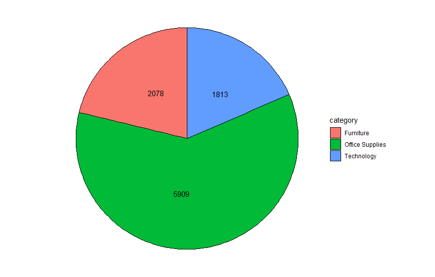
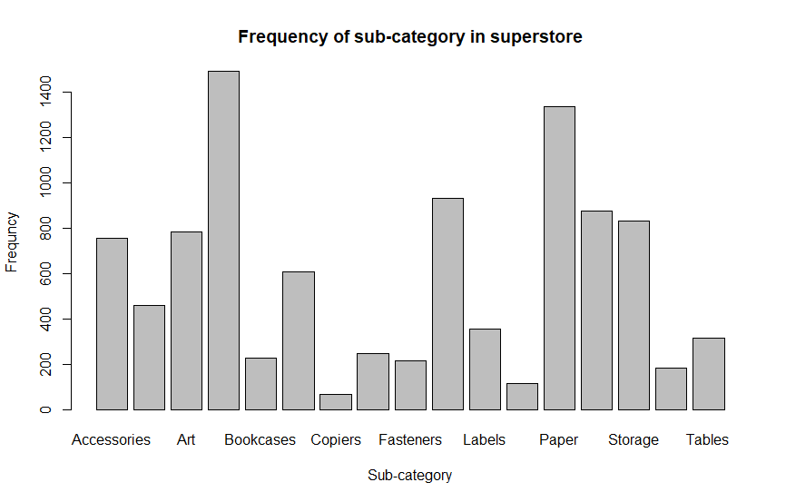

# R-Assignment 4

**Created by Vichayaphat Patthikarnsakul (ID: 63130500107)**

Choose Dataset:

**Superstore Sales Dataset (Data from Rohit Sahoo,[Kaggle](https://www.kaggle.com/rohitsahoo/sales-forecasting)) >> [Using CSV](https://raw.githubusercontent.com/safesit23/INT214-Statistics/main/datasets/superstore_sales.csv)**


### Outlines
1. Explore the dataset
2. Learning function from Tidyverse
3. Transform data with dplyr and finding insight the data
4. Visualization with GGplot2

## Part 1: Explore the dataset

```R
#import packages
library(readr)      
library(dplyr)      
library(DescTools)  
library(forcats)    
library(ggplot2)    

#import dataset
superstore <- read_csv("https://raw.githubusercontent.com/safesit23/INT214-Statistics/main/datasets/superstore_sales.csv")

#explore dataset
View(superstore)
glimpse(superstore)

```

In this dataset has .....

|Number|Column name|Data type|Details|
|----|------|----|-------|
|1|Row ID|double|Number of rows|
|2|Order ID|character|ID for each orders|
|3|Order Date|character|The date for order has been made|
|4|Ship Date|character|The date for product has been shipped|
|5|Ship mode|character|Type of shipping|
|6|Customer ID|character|ID for each customers|
|7|Customer Name|character|Name for each customers|
|8|Segment|character|Type for each customers eg. Consumer, Corporate, Home Offices|
|9|Country|character|Country for each customers belong in|
|10|City|character|City for each customers belong in|
|11|State|character|State for each customers belong in|
|12|Postal Code|double|Postal for each customers|
|13|Region|character|Region for each customers belong in|
|14|Product ID|character|ID for each products|
|15|Category|character|Category for each products|
|16|Sub-Category|character|Sub-Category for each products|
|17|Product Name|character|Name for each products|
|18|Sales|double|Total price for each orders|


## Part 2: Learning function from Tidyverse

### Package `dplyr`
-`select()` : select column and all data in that column
```R
superstore %>% select(`Order ID`, `Order Date`, `Customer Name`)
```
### Package `forcats`
-`fct_infreq()` : rearrage the frequency for each data
```R
superstore %>% mutate(Segment = fct_infreq(Segment)) %>% count(Segment)
```
### Package `ggplot2`
- `geom_text()` : Add text in the graph
- `theme_void()` : Remove background

```R
frq_category <- data.frame(table(superstore$Category))
frq_category <- frq_category %>% rename("category"=Var1,"count"=Freq)

frq_category %>% ggplot(aes(x="",y=count,fill=category)) + geom_bar(stat="identity", width=1, color="black") +
  coord_polar("y", start=0)+ theme_void() + geom_text(aes(label = count),
  position = position_stack(vjust = 0.55))
```

## Part 3: Transform data with dplyr and finding insight the data

### 1.) List all state and city without duplicate and order state by descending.
```R
superstore %>% select(State, City) %>% distinct() %>% arrange(desc(State))
```
**Result:**
```
# A tibble: 600 x 2
   State     City      
   <chr>     <chr>     
 1 Wyoming   Cheyenne  
 2 Wisconsin Madison   
 3 Wisconsin Franklin  
 4 Wisconsin Green Bay 
 5 Wisconsin Milwaukee 
 6 Wisconsin Appleton  
 7 Wisconsin Kenosha   
 8 Wisconsin Waukesha  
 9 Wisconsin Eau Claire
10 Wisconsin West Allis
# ... with 590 more rows
```
**Explain ->** The result shows that there are 600 cities in superstore dataset.

### 2.)  List all product name that have sales more than or equal to 100 without duplicate
```R
superstore %>% filter(Sales >= 100) %>% select(`Product Name`) %>% distinct()
```
**Result:**
```
# A tibble: 970 x 1
   `Product Name`                                                     
   <chr>                                                              
 1 "Bush Somerset Collection Bookcase"                                
 2 "Hon Deluxe Fabric Upholstered Stacking Chairs, Rounded Back"      
 3 "Bretford CR4500 Series Slim Rectangular Table"                    
 4 "Mitel 5320 IP Phone VoIP phone"                                   
 5 "Belkin F5C206VTEL 6 Outlet Surge"                                 
 6 "Chromcraft Rectangular Conference Tables"                         
 7 "Konftel 250 Conference phone - Charcoal black"                    
 8 "Fellowes PB200 Plastic Comb Binding Machine"                      
 9 "Stur-D-Stor Shelving, Vertical 5-Shelf: 72\"H x 36\"W x 18 1/2\"D"
10 "Cisco SPA 501G IP Phone"                                          
# ... with 960 more rows
```
**Explain ->** There are 970 products that have sales more than or equal to 100.

### 3.) Average the sales for the customer who buy technology category
```R
superstore %>% filter(Category == "Technology") %>% summarise(Mean = mean(Sales))
```
**Result:**
```
# A tibble: 1 x 1
   Mean
  <dbl>
1  456.
```
**Explain ->** Average sales for technology category is 456$.

### 4.) How many orders has been made in each category
```R
superstore %>% mutate(Category = fct_infreq(Category)) %>% count(Category)
```
**Result:**
```
# A tibble: 3 x 2
  Category            n
  <fct>           <int>
1 Office Supplies  5909
2 Furniture        2078
3 Technology       1813
```
**Explain ->** Office supplies made to the top as it has 5,909 orders, second goes to furniture as it has 2,078 orders and lastly, technology has 1,813.

### 5.) How about list the sub-category in technology category.
```R
superstore %>% filter(Category == "Technology") %>% mutate(`Sub-Category` = fct_infreq(`Sub-Category`)) %>% count(`Sub-Category`)
```
**Result:**
```
# A tibble: 4 x 2
  `Sub-Category`     n
  <fct>          <int>
1 Phones           876
2 Accessories      756
3 Machines         115
4 Copiers           66
```
**Explain ->** There are 4 things in technology category. First one, phones have 876 orders. Second, accessories have 756 orders. Third, machines have 115 orders. And last one, copiers have 66 orders.

### 6.) List all state, average_sales and order average_sales by descending.
```R
superstore %>% group_by(State) %>% select(State, Sales) %>% summarise(average_sale = mean(Sales)) %>% arrange(desc(average_sale))
```
**Result:**
```
# A tibble: 49 x 2
   State        average_sale
   <chr>               <dbl>
 1 Wyoming             1603.
 2 Vermont              812.
 3 Nevada               429.
 4 Rhode Island         410.
 5 Montana              373.
 6 Indiana              361.
 7 Missouri             336.
 8 Minnesota            336.
 9 Alabama              320.
10 Virginia             315.
# ... with 39 more rows
```
**Explain ->** The result shows 49 states and average sales for each states.

## Part 4: Visualization with GGplot2
### 1.) Graph shows the frequency for each category.
```R
frq_category <- data.frame(table(superstore$Category))
frq_category <- frq_category %>% rename("category"=Var1,"count"=Freq)

frq_category %>% ggplot(aes(x="",y=count,fill=category)) + geom_bar(stat="identity", width=1, color="black") +
  coord_polar("y", start=0)+ theme_void() + geom_text(aes(label = count),
  position = position_stack(vjust = 0.55))
```
**Result:**



### 2.) Graph shows the frequency for each sub-category.
```R
countBookType<- table(topCSBook$Type)
barplot(countBookType, main = "Amount of the books in each type",ylab = "Amount", xlab = "Book's Type")
```
**Result:**



**PART B:** [Link to dashboard](https://app.powerbi.com/view?r=eyJrIjoiZDEwNzA0NzgtZTZlZS00NWUxLWI1NmMtYTY1ZjQ3MzNkNjE1IiwidCI6IjZmNDQzMmRjLTIwZDItNDQxZC1iMWRiLWFjMzM4MGJhNjMzZCIsImMiOjEwfQ%3D%3D)
