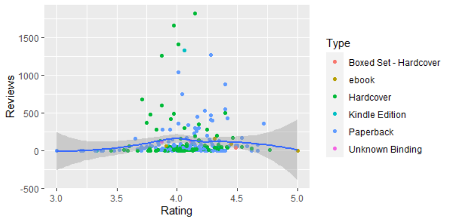
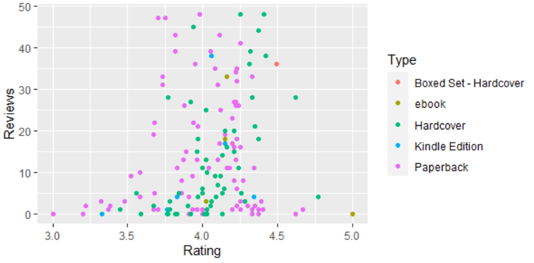
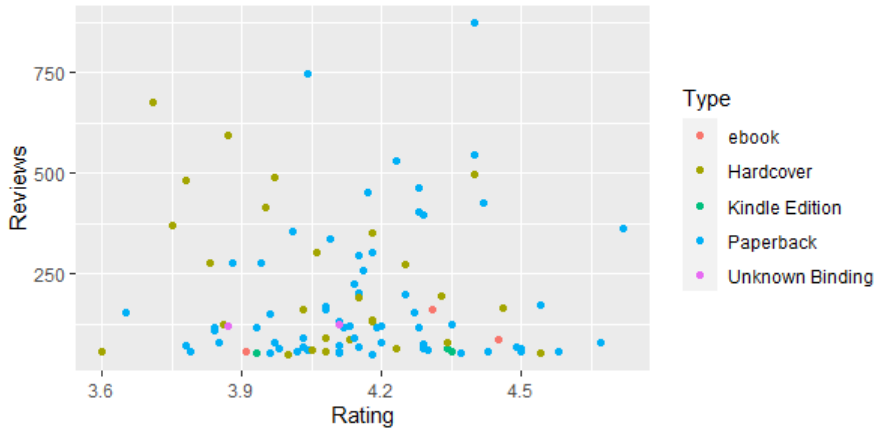
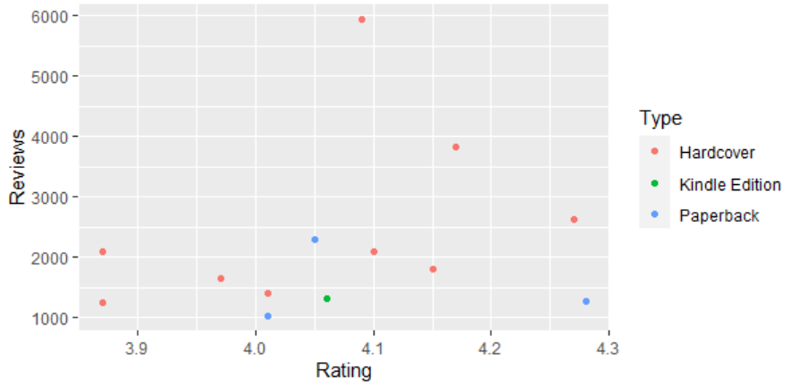
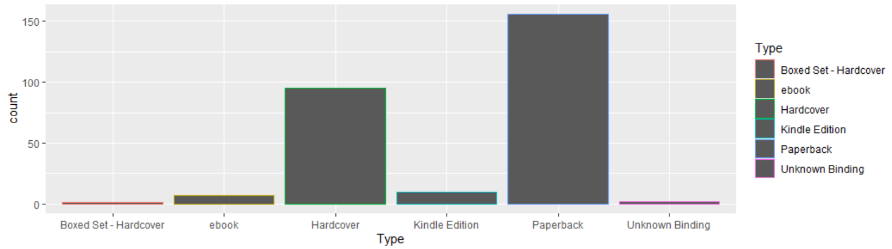
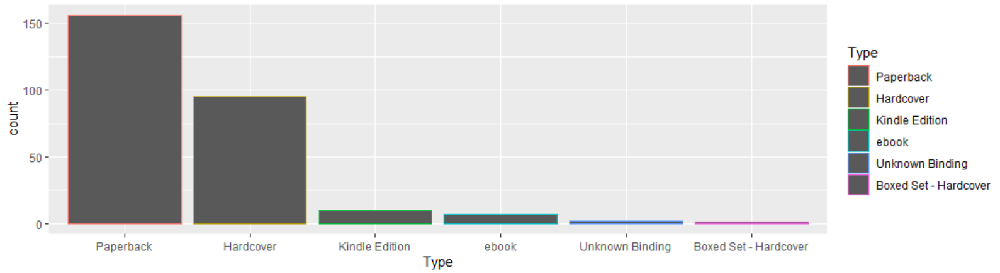
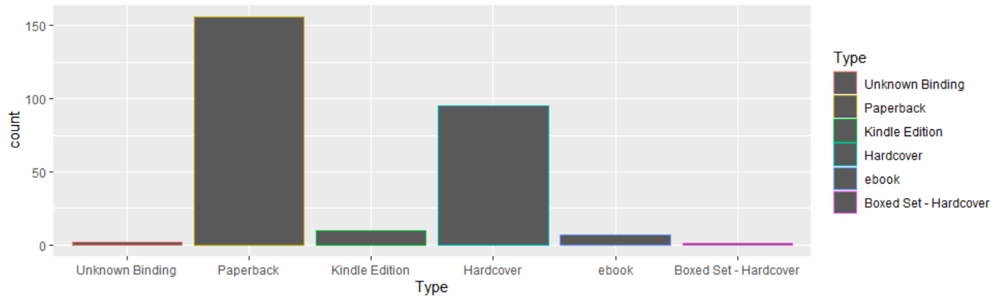

# R-Assignment 4

**Created by Aritach Krudminburee (ID: 63130500133)**

Choose Dataset:
1. Top 270 Computer Science / Programing Books (Data from Thomas Konstantin, [Kaggle](https://www.kaggle.com/thomaskonstantin/top-270-rated-computer-science-programing-books)) >> [Using CSV](https://raw.githubusercontent.com/safesit23/INT214-Statistics/main/datasets/prog_book.csv) :heavy_check_mark:

2. Superstore Sales Dataset (Data from Rohit Sahoo,[Kaggle](https://www.kaggle.com/rohitsahoo/sales-forecasting)) >> [Using CSV](https://raw.githubusercontent.com/safesit23/INT214-Statistics/main/datasets/superstore_sales.csv)

# Part A
### Outlines
1. Explore the dataset
2. Learning function from Tidyverse
3. Transform data with dplyr and finding insight the data
4. Visualization with GGplot2

## Part 1: Explore the dataset

```
# Library
library(readr)
library(dplyr)
library(ggplot2)
library(DescTools)
# Dataset
dataset <- read_csv("https://raw.githubusercontent.com/safesit23/INT214-Statistics/main/datasets/prog_book.csv")
```

In this dataset has 
```
Rows: 271
Columns: 7
$ Rating          <dbl> 4.17, 4.01, 3.33, 3.97, 4.06, 3.84, 4.09, 4.15, 3.~
$ Reviews         <dbl> 3829, 1406, 0, 1658, 1325, 117, 5938, 1817, 2093, ~
$ Book_title      <chr> "The Elements of Style", "The Information: A Histo~
$ Description     <chr> "This style manual offers practical advice on impr~
$ Number_Of_Pages <dbl> 105, 527, 50, 393, 305, 288, 256, 368, 259, 128, 3~
$ Type            <chr> "Hardcover", "Hardcover", "Kindle Edition", "Hardc~
$ Price           <dbl> 9.323529, 11.000000, 11.267647, 12.873529, 13.1647~
```
| Variable | Type of variable  | Meaning |
| :-------- | :-------- | :-------- |
| Rating | double | เก็บคะเเนนเรทติ่งของหนังสือเล่มนั้นๆ |
| Reviews | double | เก็บจำนวนความคิดเห็นที่มีต่อหนังสือเล่มนั้นๆ |
| Book_title | character | ชื่อหนังสือ |
| Description | character | คำอธิบายของหนังสือเล่มนั้นๆ |
| Number_Of_Pages | double | จำนวนหน้าของหนังสือ |
| Type | character | รูปแบบของหนังสือ |
| Price | double | ราคาของหนังสือหน่วยดอลลาร์ |

0. เช็คว่ามีค่า null ในตัว dataset ไหม
```
is.na(dataset)
```
  - ไม่มีข้อมูลใน dataset ที่เป็น null
   
1. ใน variable ที่เป็น Rating นั้น
```
max(dataset$Rating)
min(dataset$Rating)
mean(dataset$Rating)
Mode(dataset$Rating)
```
  - ค่าสูงสุดของRating : 5 
  - ค่าต่ำสุดของRating : 3
  - ค่ากึ่งกลางของRating : 4.067417
  - จำนวน Rating ที่ซ้ำมากที่สุด : 4.15  

2. ใน variable ที่เป็น Reviews นั้น
```
max(dataset$Reviews)
min(dataset$Reviews)
mean(dataset$Reviews)
Mode(dataset$Reviews)
```
  - ค่าสูงสุดของReviews : 5938 
  - ค่าต่ำสุดของReviews : 0
  - ค่ากึ่งกลางของReviews : 185.5572
  - จำนวน Reviews ที่ซ้ำมากที่สุด : 0  
  
3. ใน variable ที่เป็น Book_title นั้น
```
dataset$Book_title %>% duplicated() %>% table()
dataset$Book_title %>% duplicated() %>% sum()
```
  - ไม่มีตัวที่มีชื่อซ้ำ

4. ใน variable ที่เป็น Description นั้น
```
dataset$Description %>% duplicated() %>% table()
dataset$Description %>% duplicated() %>% sum()
dataset %>% filter(duplicated(dataset$Description))
```
  - มี Book_title ที่มี Description เหมือนกันอยู่เเต่จะเเบ่งเป็น type ของ ebook กับ Paperback โดย 2 ข้อมูลนี้มีชื่อใกล้เคียงกัน เเละ Rating , Reviews เเละราคา มีค่าเท่ากัน เเต่จำนวนหน้าไม่เท่ากัน

5. ใน variable ที่เป็น Number_Of_Pages นั้น
```
max(dataset$Number_Of_Pages)
min(dataset$Number_Of_Pages)
mean(dataset$Number_Of_Pages)
Mode(dataset$Number_Of_Pages)
```
  - ค่าสูงสุดของPages : 3168 
  - ค่าต่ำสุดของPages : 50
  - ค่ากึ่งกลางของPages : 475.0775 
  - จำนวนหน้าที่ซ้ำกันมากที่สุดคือ : 288

6. ใน variable ที่เป็น Type นั้น
```
 dataset %>% count(Type)
```
```
# Result: 
1 Boxed Set - Hardcover     1
2 ebook                     7
3 Hardcover                95
4 Kindle Edition           10
5 Paperback               156
6 Unknown Binding           2
```
  - ใน variable จะมี type เเค่ 6 ชนิด ตามลำดับเเละ type ที่มากที่สุด คือ Paperback
  
7. ใน variable ที่เป็น Price นั้น
```
max(dataset$Price)
min(dataset$Price)
mean(dataset$Price)
Mode(dataset$Price)
```
  - ค่าสูงสุดของPrice : 235.65 
  - ค่าต่ำสุดของPrice : 9.323529
  - ค่ากึ่งกลางของPrice : 54.54186
  - จำนวนราคาที่ซ้ำกันมากที่สุดคือ : 51.47353
  
## Part 2: Transform data with dplyr and finding insight the data

1. หาหนังสือที่ที่มี Rating ระหว่าง 4.5 - 5.0
เรานั้นทำการ ใช้ filter จาก dplyr เพื่อเอาข้อมูลในช่วงที่ Rating ระหว่าง 4.5 - 5.0 จากนั้นค่อยทำการใช้ select จาก dplyr เพื่อให้เเสดงเเค่ column Book_title
```
A1 <- dataset  %>% filter(Rating >=4.5) %>% select(Book_title)
A1 
```

Result:

```
1 ZX Spectrum Games Code Club: Twenty fun games to code and ~
2 Your First App: Node.js                                    
3 High Performance Browser Networking                        
4 The Elements of Computing Systems: Building a Modern Compu~
5 Build Web Applications with Java: Learn every aspect to bu~
6 C# in Depth                                                
7 Designing Data-Intensive Applications: The Big Ideas Behin~
8 The Linux Programming Interface: A Linux and Unix System P~
9 Practical Object Oriented Design in Ruby                   
10 Fluent Python: Clear, Concise, and Effective Programming   
11 CLR via C# (Developer Reference)                           
12 The Art of Computer Programming, Volumes 1-4a Boxed Set
จาก Top 270 Computer Science / Programing Books พบว่าในระหว่าง Rating 4.5 ขึ้นไป จะมีอยู่ 12 เล่มส่วนชื่อดังที่เเสดงใน Result ข้างต้น
```
2. หาหนังสือที่ Rating = 4.0 จะมีค่า mean ของ Price เท่ากับเท่าไร
เรานั้นทำการ ใช้ filter เพื่อเอาข้อมูลในช่วงที่ Rating = 4.0 จากนั้นค่อยทำการ summarise เพื่อคำนวณหาค่า mean ของ Price โดยใช้ Mean

```
A2 <- dataset %>% filter(Rating == 4.0 )  %>% summarise(Mean=mean(Price))
A2                                  
```

Result:

```
   Mean
  <dbl>
1  55.6
จาก Top 270 Computer Science / Programing Books พบว่าตอนที่ค่า Rating เท่ากับ 4.0 นั้นมีค่ากึ่งกลางของPrice เท่ากับ 55.6
```
3. จำนวนของหนังสือที่มีค่า Rating ต่ำสุด 
เรานั้นทำการ ใช้ filter เพื่อเอาข้อมูลในช่วงที่ Rating = min โดย min นั้นจะได้มาจาก `min(Rating)` จากนั้นค่อยทำการ summarise เพื่อทำการนับจำนวนหรือก็คือ count

```
A3 <-  dataset  %>% filter(Rating == min(Rating)) %>% summarise(count = n())                        
A3
```

Result:

```
  count
  <int>
1     3
จาก Top 270 Computer Science / Programing Books พบว่าตอนที่ค่า Rating น้อยที่สุด นั้นมีจำนวน เท่ากับ 3 
```
4. ผลต่างของจำนวนหนังสือระหว่าง Kindle Edition กับ ebook ต่างกันเท่าไร
เราได้ให้ตัวเเปร x นั้นเก็บค่าที่เรา filter โดยกำหนด Type เป็น Kindle Edition เเล้วทำการ summarise เพื่อนับจำนวนของข้อมูล
จากนั้นก็ทำตัวเเปร y เเต่ครั้งนี้จะกำหนดค่าเป็น ebook เเทนเเล้วค่อยนำมาลบกัน เพื่อหาผลต่าง
```
x<-dataset %>% filter(Type == "Kindle Edition") %>% summarise(count = n())
y<-dataset %>% filter(Type == "ebook") %>% summarise(count = n())
x-y
```

Result:

```
  count
1     3
จาก Top 270 Computer Science / Programing Books พบว่าผลต่างของจำนวนหนังสือระหว่าง Kindle Edition กับ ebook เท่ากับ 3
```
5. หา Type ของหนังสือที่มากที่สุด เเละ มี Reviews มากกว่าเท่ากับ 1000
เราได้ทำการ filter โดยจะเลือกข้อมูลที่มี Reviews มากกว่าเท่ากับ 1000 เเล้วค่อยทำการ summarise เพื่อให้คำนวณหา Mode ได้

```
A5 <- dataset %>% filter(Reviews >= 1000) %>% summarise(Mode = Mode(Type))
A5
```

Result:

```
  Mode     
  <chr>    
1 Hardcover
จาก Top 270 Computer Science / Programing Books พบว่า Type ของหนังสือที่มากที่สุด เเละมีการ Reviews มากกว่าเท่ากับ 1000 นั้นคือ Type Hardcover
```
6. หาค่ามากที่สุดหรือน้อยที่สุดของ Number_Of_Pages ที่ type เท่ากับ Kindle Edition
เราได้กำหนด filter เป็น type Kindle Edition เเล้วทำการ summarise หาค่า max เเละ min ของ Number_Of_Pages 

```
A6 <- dataset %>% filter(Type == "Kindle Edition") %>% summarise(min=min(Number_Of_Pages),max= max(Number_Of_Pages)) 
A6
```

Result:

```
    min   max
  <dbl> <dbl>
1    50   422
จาก Top 270 Computer Science / Programing Books พบว่าจำนวนหน้าน้อยสุดเเละมากสุด ของ type Kindle Edition คือ 50ม422 ตามลำดับ
```


## Part 3: Visualization with GGplot2
### 1.) Graph show relation between Rating and Reviews
```
# Graph relation between Rating and Reviews
 scat_plot0 <- dataset %>% filter(Reviews <= 2000 )%>% ggplot(aes(x=Rating,y=Reviews))+
   geom_point(aes(color=Type)) +geom_smooth()
 scat_plot0
# การกระจายข้อมูลในช่วง Reviews = 0 - 50
scat_plot1 <- dataset %>%filter(Reviews<50)%>%ggplot(aes(x=Rating,y=Reviews))+
   geom_point(aes(color=Type)) 
 scat_plot1
# การกระจายข้อมูลในช่วง Reviews = 50 - 1000
 scat_plot2 <- dataset %>% filter(Reviews <= 1000 ) %>% filter(Reviews >= 50 )%>%ggplot(aes(x=Rating,y=Reviews))+
   geom_point(aes(color=Type)) 
 scat_plot2
 
# การกระจายข้อมูลในช่วง Reviews = 1000 - 6000
 scat_plot3 <- dataset %>% filter(Reviews <= 6000 ) %>% filter(Reviews >= 1000 )%>%ggplot(aes(x=Rating,y=Reviews))+
   geom_point(aes(color=Type))
 scat_plot3
```
Result:
* Graph relation between Rating and Reviews

* การกระจายข้อมูลในช่วง Reviews = 0 - 50

* การกระจายข้อมูลในช่วง Reviews = 50 - 1000

* การกระจายข้อมูลในช่วง Reviews = 1000 - 6000


จะเป็นได่ว่ากราฟนี้เป็น กราฟที่จะเเกนตั้งจะเป็น Reviews ส่วนเเกนนอนจะเป็น Rating จึงเป้นความสัมพันธ์ของสองสิ่งนี้ ที่เเสดงในรูปกราฟเเบบจุด ที่จะใช้สีเเบ่งเป็นว่า จุดReviewsเเละRating นั้นเป็นtypeไหน
เเต่จะมีปัญหาตรงที่ว่าข้อมูลที่เรานำมา plot กราฟนั้นมีข้อมูลที่โดดไปสูงมาก ตอนกราฟ 0 เราจึงทำการตัดให้เอาเเค่ค่าที่ต่ำกว่า2000เพื่อจะดูกราฟเส้นเส้นการถดถอยบนกราฟเพื่อข้อมูลส่วนใหญ่จะอยู่ต่ำกว่า2000เป็นส่วนใหญ่นั้นเอง
ซึ่งจะเห็นได้ว่าเส้นนั้นจะอยู่บริเวณด้านล่างบริเวณใกล้ 0 Rating ส่วนใหญ่จะอยู่ประมาณ 4.0 เป็นกราฟระฆังคว่ำที่บริเวณปลายRatingเเละต้นRatingนั้นจะมีปริมาณที่น้อยซึ่ง type ส่วนมากเป็น hardcover นั้นเอง 
ส่วนกราฟที่เหลือ คือ จะเเค่ให้ดูว่าเเต่ละข้อมูลนั้นในเเต่ละช่วงข้อมูลมีการกระจายเป็นอย่างไรบ้าง
### 2.) แผนภูมิเเท่งเเสดงจำนวนของ type ต่างๆ
```
# แผนภูมิเเท่งเเสดงจำนวนของ type ต่างๆ
 scat_plot4 <- dataset %>% ggplot(aes(x=Type)) + geom_bar(aes(color=Type)
 scat_plot4
```
Result:
* แผนภูมิเเท่งเเสดงจำนวนของ type ต่างๆ

จะเป็นกราฟที่บอกจำนวนของข้อมูลว่าเป็น type อะไรบ้างเเละมีมากน้อยเเค่ไหน เเละใช้สีที่กราฟเพื่อกันความสับสนเเละทำให้เเยกอออกว่ากราฟเเท่งไหนเป็นของ type อะไร ซึ่งจะเห็นได้ว่า ปริมาณ typeของหนังสือ ที่มากที่สุดคือ paperback เเละ รองลงมาจะเป็น hardcover ส่วนที่เหลือจะมีปริมาณน้อยมาก

## Part 4: using command from tidyverse (e.g. lubridate, stringr, forcats) that not learned in class

Function ที่จะเลือกใช้คือ `forcats` 
เป็น package ที่ทำการจัดการลำดับข้อมูลข้อมูล dataset ที่เราใช้งาน
ref : https://forcats.tidyverse.org/
```
install.packages("forcats")
library("forcats")
```
### 
โดยจะมีตัวอย่าง code ดังต่อไปนี้
1. `fct_infreq()`
จะเป็นการคำสั่งที่จะ return ค่ามาเป็นการจัดเรียงลำดับตามตัวเเปรที่ใส่ในวงเล็บโดยตัวที่มีความถี่มากสุดจะขึ้นก่อน
ตัวอย่าง 
เราใช้กราฟจาก แผนภูมิเเท่งเเสดงจำนวนของ type ต่างๆ มาทำการมาใส่  mutate(Type = fct_infreq(Type)) มาทำการสร้าง row ใหม่ โดยอิงตามลำดับความถึ่ของตัวเเปร 
```
scat_plot6 <- dataset %>% mutate(Type = fct_infreq(Type)) %>% ggplot(aes(x=Type)) + geom_bar(aes(color=Type)) 
scat_plot6
```


2. `fct_rev()`
จะเป็นการคำสั่งที่จะ return ค่ามาเป็นตรงกันข้าม หรือก็คือการ Reverse นั้นเองดังตัวอย่างเราใส่โดยอิงจากกราฟ แผนภูมิเเท่งเเสดงจำนวนของ type ต่างๆ จะเห็นได้ว่าลำดับของข้อมูลจะสลับกันหมดเลยนั้นเอง
```
scat_plot6 <- dataset %>% mutate(Type = fct_rev(Type)) %>% ggplot(aes(x=Type)) + geom_bar(aes(color=Type)) 
scat_plot6
```
Before

After



# Part B
use Power Bi
```
https://app.powerbi.com/view?r=eyJrIjoiOTE1MDUyYjEtNzk4YS00ODRjLWJjMTYtZTEzNzFmNmI5NWVlIiwidCI6IjZmNDQzMmRjLTIwZDItNDQxZC1iMWRiLWFjMzM4MGJhNjMzZCIsImMiOjEwfQ%3D%3D&pageName=ReportSection
```
© 2021 GitHub, Inc.
Terms
P
